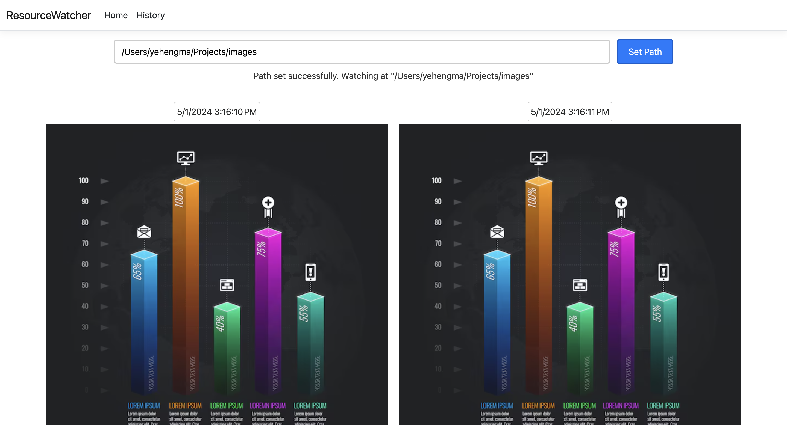

# What is this project:

An image generation watcher. It displays the real-time updated image and historical records.

# When to use it:

When there is a need to monitor the image output of a program.

# Requirements:

Docker, .NET runtime (8.x), Bash

# Limitations:

Directory in the watched directory not supported yet.

# How to use it:

## 1. Fork and clone this repository

```
git clone [your-forked-repository]
```

## 2. Enter the directory

```
cd [directory-to-project]
```

### 3. Start the project:

```
./start.sh
```

### 4. Select the directory to watch, where the output images will be


### 5. Wait for the image outputs to be rendered:



